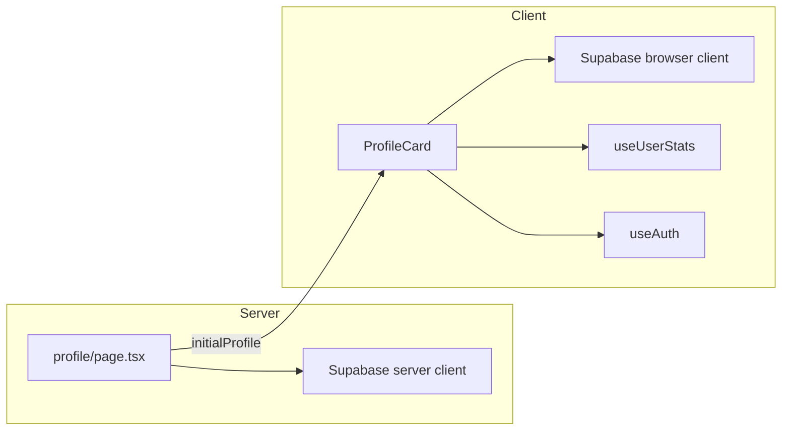

# Profile page (trainer card)

This document describes the Pokémon-inspired profile experience: layout, data flow, persistence, assets, and local development notes.

## Overview

The `/profile` route shows a **trainer card** instead of the previous stats dashboard:

- **Left:** Large avatar from [Pokémon Showdown trainer sprites](https://play.pokemonshowdown.com/sprites/trainers/) (random on first assignment if the user does not already use a Showdown URL), with editable display name.
- **Right:** Profile rows (name, email, joined), **stats** derived from existing aggregates (`useUserStats`), and a flavor **Ability** line based on performance.
- **Edit mode:** Save updates both **Supabase Auth `user_metadata`** and **`public.profiles`** so the navbar and server stay aligned.

## File map

| Area | Path |
|------|------|
| Route (server) | [`src/app/profile/page.tsx`](../src/app/profile/page.tsx) |
| Main UI (client) | [`src/components/profile/ProfileCard.tsx`](../src/components/profile/ProfileCard.tsx) |
| Sprite picker modal | [`src/components/profile/TrainerSpritePicker.tsx`](../src/components/profile/TrainerSpritePicker.tsx) |
| Curated sprites + helpers | [`src/data/trainerSprites.ts`](../src/data/trainerSprites.ts) |
| Navbar avatar tweaks | [`src/components/Navbar.tsx`](../src/components/Navbar.tsx) |
| Auth hook extras | [`src/hooks/useAuth.ts`](../src/hooks/useAuth.ts) |
| Remote images (Showdown) | [`next.config.ts`](../next.config.ts) `images.remotePatterns` |

## Architecture



1. **Server (`profile/page.tsx`)**  
   - Requires session; redirects to sign-in if missing.  
   - Loads `profiles` row: `id`, `email`, `avatar_url`, `full_name`, `created_at`.  
   - Renders `ProfileCard` with that payload.

2. **Client (`ProfileCard`)**  
   - Initializes display name and avatar from `initialProfile` and/or `user.user_metadata`.  
   - If `avatar_url` is not a Showdown trainer URL, picks a random sprite from the curated list and persists (auth + `profiles`).  
   - **Save:** `auth.updateUser({ data: { full_name, avatar_url } })` and `profiles.upsert(...)`, then `refreshUser()`.

3. **Stats**  
   Reuses [`useUserStats`](../src/hooks/useUserStats.ts) (same tables as the old dashboard: `user_mode_totals`, etc.) for summary bars on the card.

4. **Sprites**  
   URLs are `https://play.pokemonshowdown.com/sprites/trainers/{id}.png`. The repo ships a **curated** list in `trainerSprites.ts` (maintainability vs. indexing the full Showdown directory).

## Database persistence (does the avatar reset?)

**No — not after it has been saved.** Profile edits are written to two places:

1. **`public.profiles`** — `avatar_url`, `full_name`, `email`, `updated_at` via `upsert` (RLS: row owner only).
2. **Supabase Auth `user_metadata`** — same `avatar_url` and `full_name` via `auth.updateUser({ data: { ... } })` so the client session and **navbar** stay in sync without an extra fetch.

On each visit to `/profile`, the **server** loads the `profiles` row and passes it as `initialProfile`. `ProfileCard` initializes local state from `initialProfile` first, then auth metadata. If `avatar_url` is already a Pokémon Showdown trainer URL (`https://play.pokemonshowdown.com/sprites/trainers/...`), the **auto-assign random sprite** logic does not run.

**First-time / Google photo users:** If the stored avatar is not a Showdown URL (e.g. Google `picture`), the UI picks a random trainer once, then **persists** it to both stores. After that succeeds, the next visit loads the saved URL from the database — it does not randomize again.

**Manual edits:** Choosing a sprite or display name and clicking **Save** updates both `profiles` and `user_metadata` again.

If you ever see a mismatch (e.g. DB updated but navbar stale), a refresh or `refreshUser()` after save realigns the session; the design already calls `refreshUser()` after successful save/auto-assign.

## Environment variables

| Variable | Purpose |
|----------|---------|
| `NEXT_PUBLIC_SUPABASE_URL` | Supabase project URL |
| `NEXT_PUBLIC_SUPABASE_ANON_KEY` or `NEXT_PUBLIC_SUPABASE_PUBLISHABLE_KEY` | Anon/publishable key (see OAuth callback note below) |
| `NEXT_PUBLIC_APP_ORIGIN` (optional) | e.g. `http://localhost:3000` — forces OAuth `redirectTo` origin when it must differ from `window.location` (LAN vs localhost) |

## OAuth callback (local dev)

[`src/app/auth/callback/route.ts`](../src/app/auth/callback/route.ts) creates the Supabase server client with:

```ts
process.env.NEXT_PUBLIC_SUPABASE_PUBLISHABLE_KEY ??
process.env.NEXT_PUBLIC_SUPABASE_ANON_KEY
```

If only `NEXT_PUBLIC_SUPABASE_ANON_KEY` is set (common in `.env.local`), the callback still works. Missing URL/key redirects to `/auth/error` instead of a 500.

**Supabase dashboard:** Allow local callbacks (e.g. `http://localhost:3000/auth/callback`, `http://localhost:3000/**`) under Authentication → URL Configuration. For strict local testing, temporarily setting **Site URL** to `http://localhost:3000` avoids fallback to production.

## Navbar

Profile thumbnails use `user_metadata.avatar_url` (fallback: default asset). Trainer sprites are full-body PNGs, so avatars use **`object-cover object-top`** and a light **`bg-white/5`** behind transparent pixels.

## Credits / sprites

Trainer art is served from Pokémon Showdown’s public sprite directory. Their index notes artist credits and usage expectations — see [Trainer sprites - Showdown!](https://play.pokemonshowdown.com/sprites/trainers/).

## Related docs

- [`PROJECT_WALKTHROUGH.md`](./PROJECT_WALKTHROUGH.md) — broader app flow  
- [`AUTH_REFACTOR_SUMMARY.md`](./AUTH_REFACTOR_SUMMARY.md) — auth patterns  

## Future ideas

- Link from profile to a dedicated **full stats** page reusing `StatsDashboard`.  
- Optional API route + cache to load the full Showdown trainer list instead of a curated file.  
- Server action or route handler for profile updates to centralize validation.
